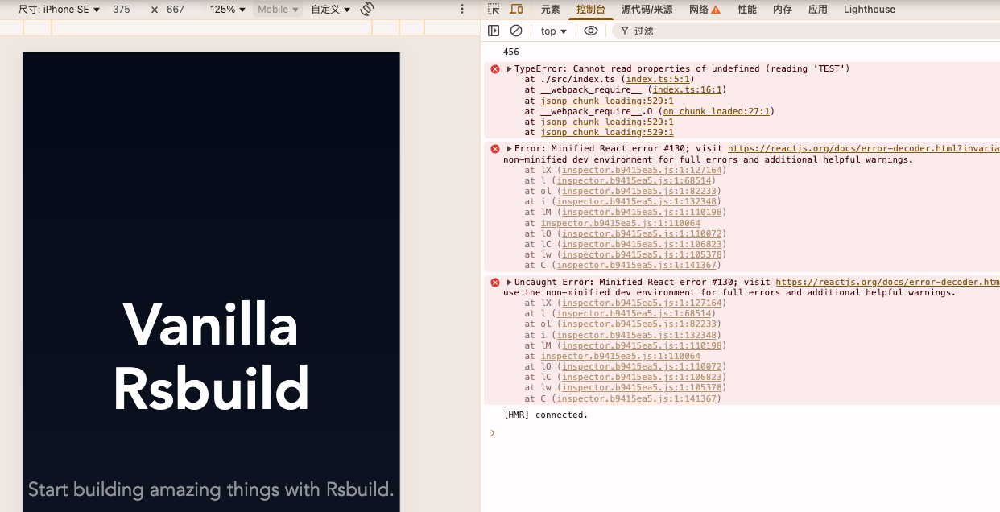
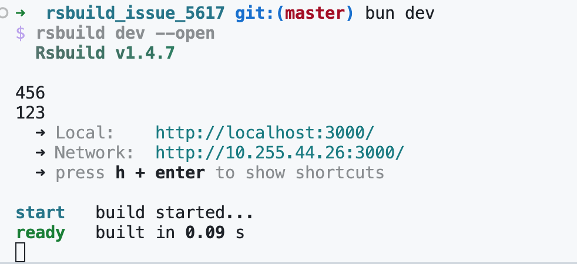
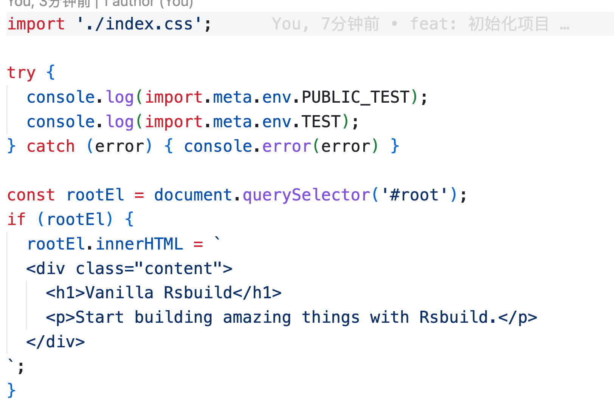
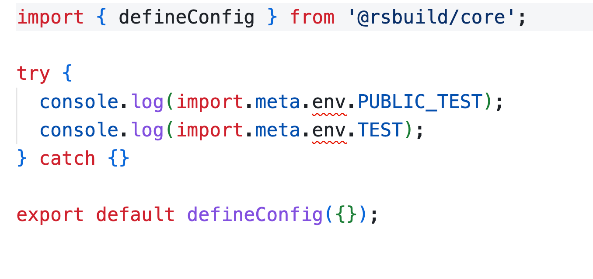

# RSBUILD_ISSUE_5617

```bash
# node18
bun install
bun run dev
```

### The environment variables can be used in web and node.

```typescript
try {
  console.log(import.meta.env.PUBLIC_TEST);
  console.log(import.meta.env.TEST);
} catch (error) { console.error(error) }
```

**# Web** 


**# Node** 


### But the type-check is only useful in web.

**# index.ts** 


**# rsbuild.config.ts** 

